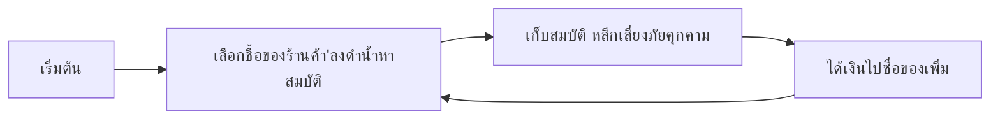

# [Deep in the Depth] — Core Loop & Gameplay

## Core Loop

## Core Mechanics

1. [Mechanic หลักที่ 1 ระบบ oxygen]
2. [Mechanic ชื้อของและอัพเกรด]

## Controls

|   Key   | Action         |
| :-----: | -------------- |
| W.A.S.D | Move           |
|  Space  | พุ่ง       |
|    E    | เก็บของ |

## Win / Lose Condition

- **ชนะเมื่อ:** [เก็บสมบัติ จนมีมูลค่าครบที่กำหนด และหนีขึ้นไป]
- **แพ้เมื่อ:** [อากาศหมด,ถูกศัตรูจัดการ]
