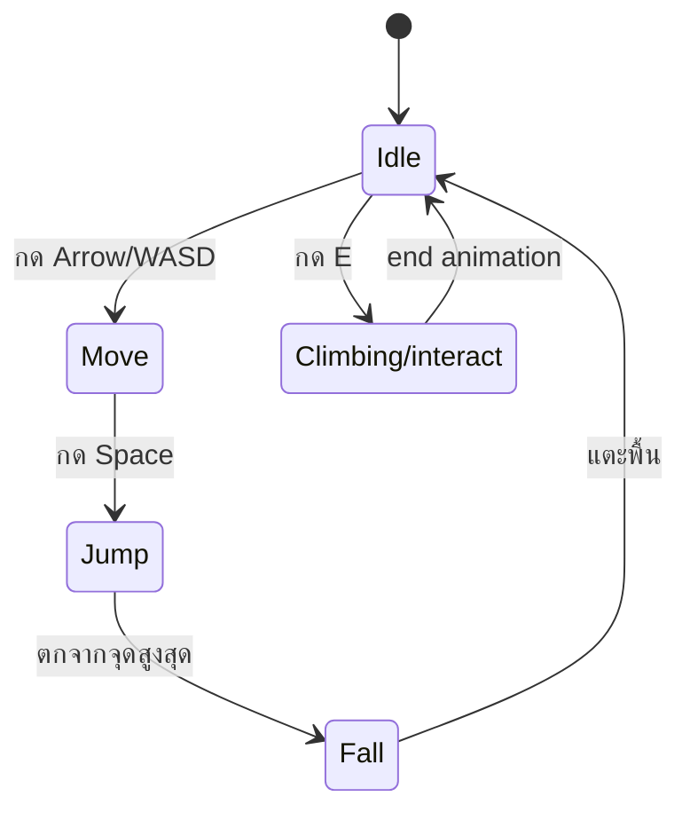
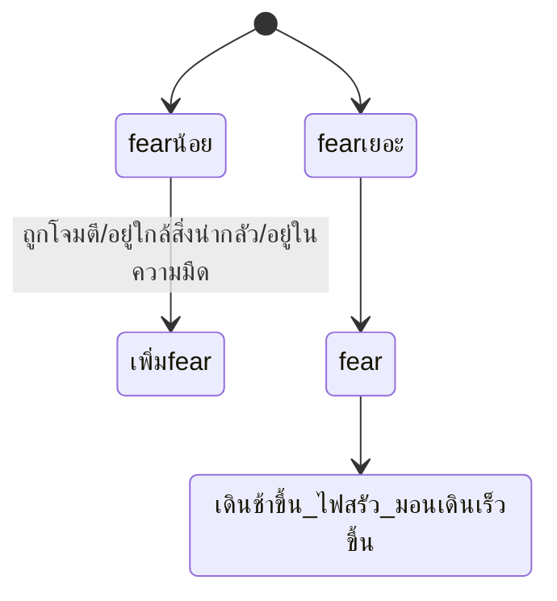
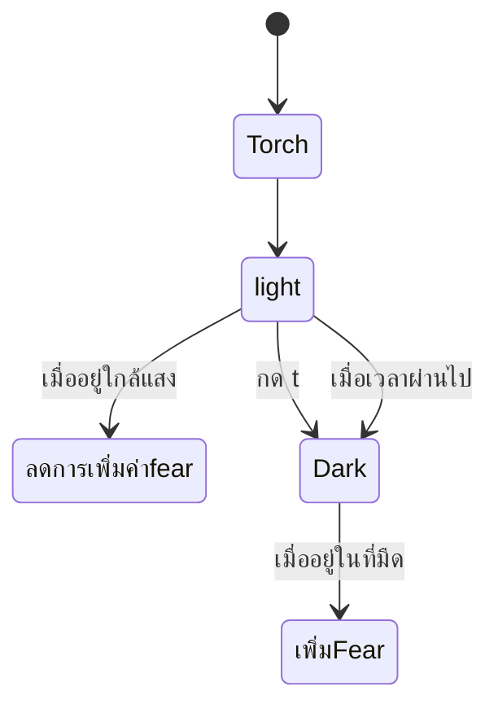

# Mechanic Design — [Movement]

## State Diagram

Mechanic Design — [fear]

## Mechanic Design — [Torch]

## Rules

| State | เข้าเงื่อนไข                        | ออกเงื่อนไข                       | Note               |
| ----- | ----------------------------------------------- | -------------------------------------------- | ------------------ |
| Idle  | เริ่มเกม / หยุดเคลื่อนที่ | กด input ใดๆ                            | Animation loop     |
| Move  | กดปุ่มทิศทาง                        | ปล่อยปุ่ม / กระโดด            | Speed = [ค่า]   |
| Jump  | กด Space ขณะอยู่พื้น               | ถึงจุดสูงสุด                     | Gravity = [ค่า] |
| fear  | ค่า Fear ถึงระดับที่กำหนด    | หายไปเมื่อเวลาผ่านไป     | max 100            |
| ligh  | มี Torch อยู่ และกด T                | Torch หมด หรือกด T อีกครั้ง | dulability 100     |
